<!-- SOHAM ROY GITHUB PROFILE -->

<picture>
  <source media="(prefers-color-scheme: dark)" srcset="assets/dark/header-animated.gif">
  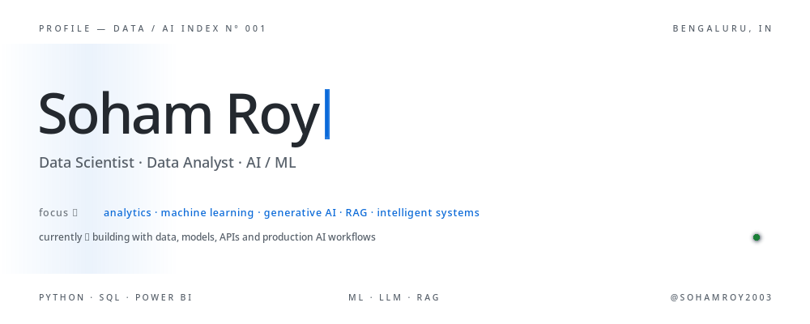
</picture>

<picture>
  <source media="(prefers-color-scheme: dark)" srcset="assets/dark/s01.svg">
  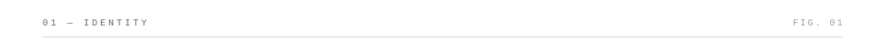
</picture>

<picture>
  <source media="(prefers-color-scheme: dark)" srcset="assets/dark/identity-animated.gif">
  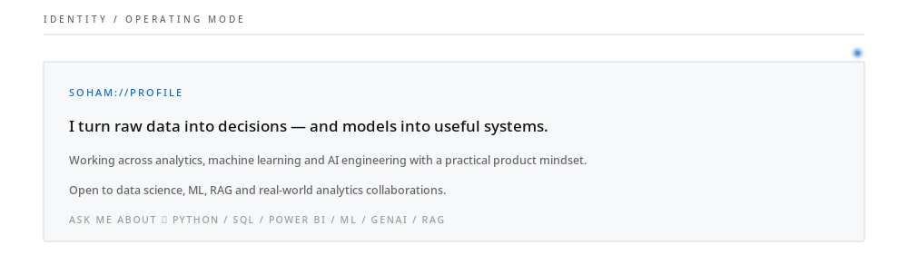
</picture>

<picture>
  <source media="(prefers-color-scheme: dark)" srcset="assets/dark/s02.svg">
  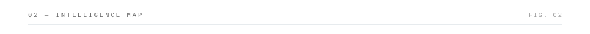
</picture>

<picture>
  <source media="(prefers-color-scheme: dark)" srcset="assets/dark/intelligence-map-animated.gif">
  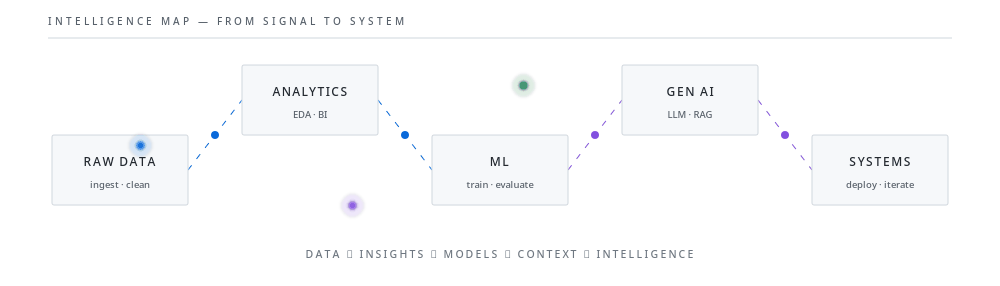
</picture>

<picture>
  <source media="(prefers-color-scheme: dark)" srcset="assets/dark/s03.svg">
  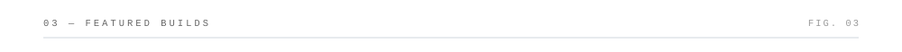
</picture>

<table><tr>
<td width="50%"><a href="https://github.com/sohamroy2003/zepto-inventory-sql-analysis"><picture><source media="(prefers-color-scheme: dark)" srcset="assets/dark/project-1.svg">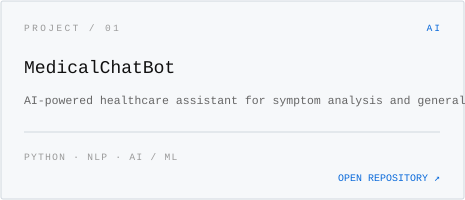</picture></a></td>
<td width="50%"><a href="https://github.com/sohamroy2003/Price-Predictor-system"><picture><source media="(prefers-color-scheme: dark)" srcset="assets/dark/project-2.svg">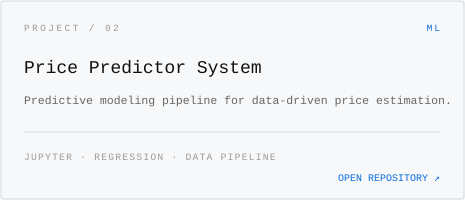</picture></a></td>
</tr><tr>
<td width="50%"><a href="https://github.com/sohamroy2003/AI-Resume-Builder-main"><picture><source media="(prefers-color-scheme: dark)" srcset="assets/dark/project-3.svg">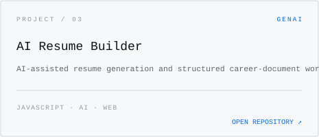</picture></a></td>
<td width="50%"><a href="https://github.com/sohamroy2003/AgentBay-p1"><picture><source media="(prefers-color-scheme: dark)" srcset="assets/dark/project-4.svg">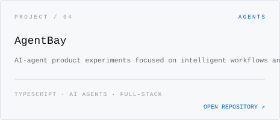</picture></a></td>
</tr></table>

<picture>
  <source media="(prefers-color-scheme: dark)" srcset="assets/dark/s04.svg">
  
</picture>

<picture>
  <source media="(prefers-color-scheme: dark)" srcset="assets/dark/telemetry-animated.gif">
  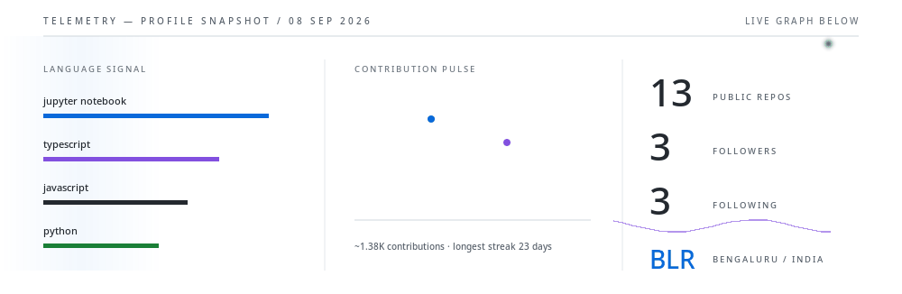
</picture>

<!-- Live streak: intentionally compact and borderless -->
<picture>
  <source media="(prefers-color-scheme: dark)" srcset="https://streak-stats.demolab.com?user=sohamroy2003&hide_border=true&background=00000000&ring=58A6FF&fire=58A6FF&currStreakLabel=58A6FF&sideLabels=8B949E&dates=8B949E&currStreakNum=F0F6FC&sideNums=F0F6FC">
  
</picture>

<!-- Live commit / contribution activity -->
<picture>
  <source media="(prefers-color-scheme: dark)" srcset="https://github-readme-activity-graph.vercel.app/graph?username=sohamroy2003&bg_color=00000000&color=8b949e&line=58a6ff&point=bc8cff&area=true&area_color=58a6ff&hide_border=true&radius=0&custom_title=COMMIT%20%2F%20CONTRIBUTION%20ACTIVITY">
  
</picture>

<picture>
  <source media="(prefers-color-scheme: dark)" srcset="assets/dark/s05.svg">
  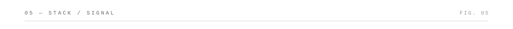
</picture>

<picture>
  <source media="(prefers-color-scheme: dark)" srcset="assets/dark/stack-animated.gif">
  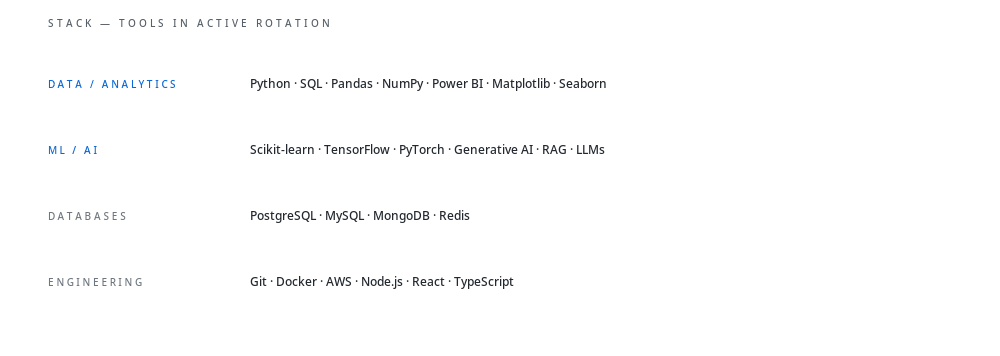
</picture>

<picture>
  <source media="(prefers-color-scheme: dark)" srcset="assets/dark/footer-animated.gif">
  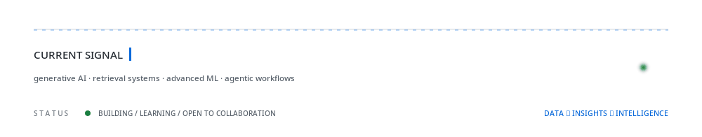
</picture>

Designed around data, models and intelligent systems — without the usual README clutter.

